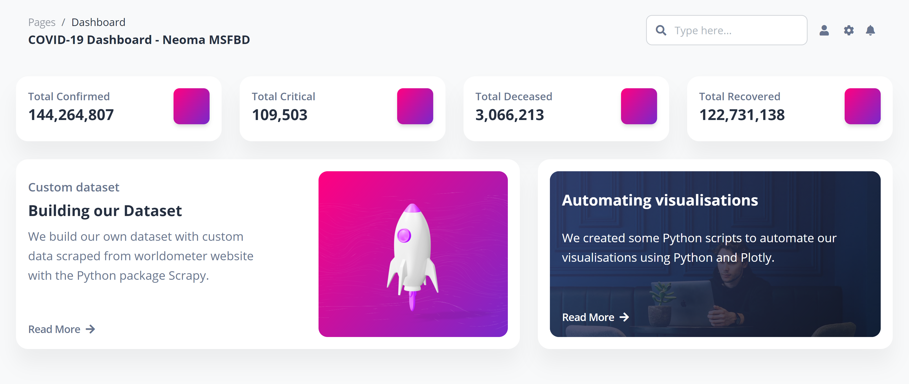

# Scraping

The aim of this project is to use Scrapy to build a custom covid-19 dataset and Plotly to automate visualisations of key statistics.
You can take a look at the website [here](https://v-e.github.io/scraping/)
